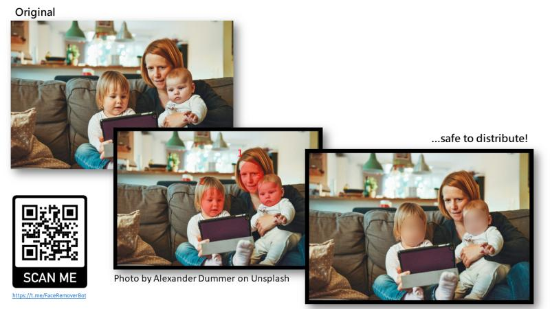

# python-telegram-bot-remove-face-with-aws-rekognition

The source code of a telegram bot intended to anonimize faces based on AWS Rekognition.
Bot is made in Python and uses Pillow and Python-Telegram-Bot framework.

You can read more about the story on my blog!

https://aws.plainenglish.io/how-aws-rekognition-helps-protect-childhood-2386eddda9d0
